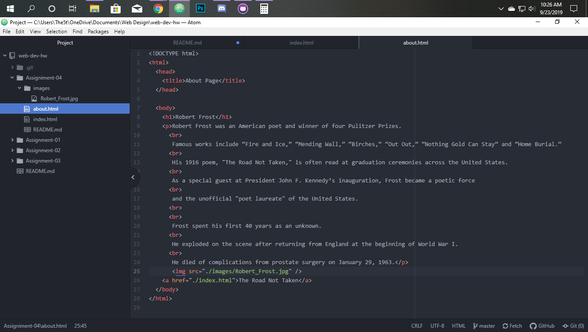

# Assignment 4
## William Kirkpatrick
The Wayback Machine:
On The Wayback Machine ! went to youtube as of June 7th 2007 and boy has youtube changed.
It was built then using hyperlinks and a single low quality static shot of the video you are trying to go to.
The tabs it had were Videos, categories, channels, and community none of which are set up like they are today.
The biggest difference is that I didn't see anything at all about subscriptions or suggested videos.

Git Module:
On Git I honestly learned a lot because just about everything is new to me. As a person entirely unexperienced with coding in any form I learned things with each and every lesson.  As for difficulty, there was nothing so far that I have had trouble with or don't understand. Although if I had to figure things out on my own it would have been hard, with the walkthroughs and website everything has been relatively easy for me.

