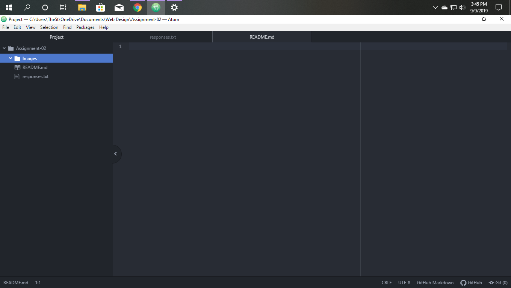

# Assignment-02
## William Kirkpatrick

I chose to take this class because a number of my friends already are pretty knowledgeable about coding and I know nothing about it going into this.  And I am not expecting to master web design or anything from this class but I would love to have at least a basic understanding of it.  On top of that I am thinking about double majoring into media arts so this will be a required course for that.  Of course it being required is something I just see as a bonus because I might not major media arts but I definitely want to finish and learn from this class.

 1. I hope to gain a basic knowledge about coding and the interworking's of websites
 2. I hope to use this class as a stepping stone to eventually create professional grade websites
 3. I already learned things about how to better organize my computer and I want to continue.

 [Youtube](https://www.youtube.com/)

 [My Responses File](./responses.txt)

 
 
