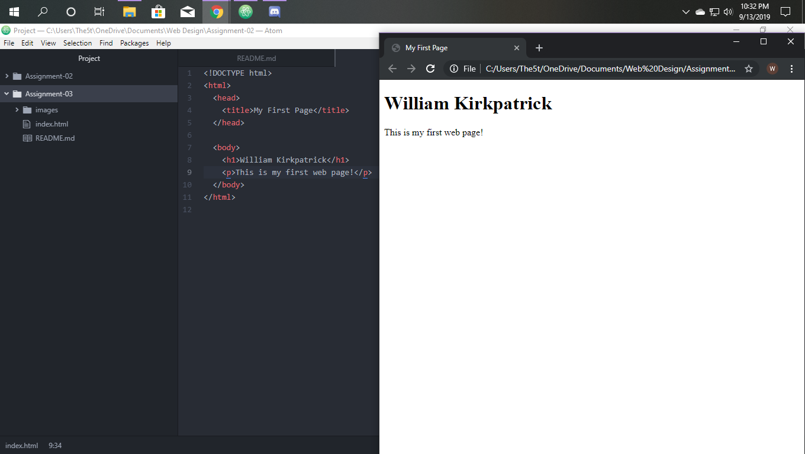

How do browsers function? List any browsers you currently use to surf - or even develop for - the web.

Browsers are a form of application that locates, uses, and show the information stored on the Web. This is done through the browser requesting the information from a server which in this case is the web itself.  As for browsers I personally really only use chrome and rarely touch much else.  

What is a markup language? Describe one commonly used in development.

A markup language is a system that allows you to use tags to create elements in a certain document, because of this it can use readable ordinary words instead of programming syntax.  An example of a markup language is the one we used this week html.  html is used to make and format webpages. much like I just finished doing myself.

