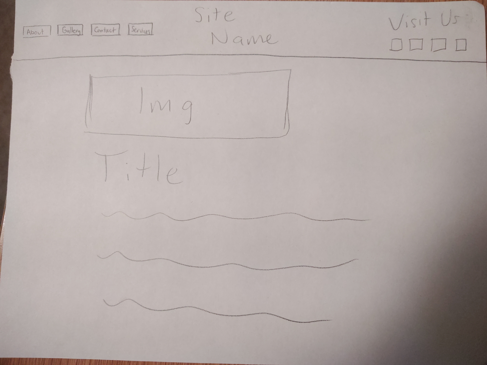

What is the difference between padding, margin, and borders?

The margin is the outer space of an element the padding is the inner space of an element and boarders are in between them.

Embed the image of your sketch. image icon

Free Response: Summarize your work cycle for this assignment

For this assignment I first sketched the basic design and the kind of played around with the styles in css for while to see if I could just figure things out on my own then I went back and read the readings for the assignment and fixed things up.  I did try to watch the walkthrough but I don't think there was one linked at all this week as I certainly couldn't open it 
